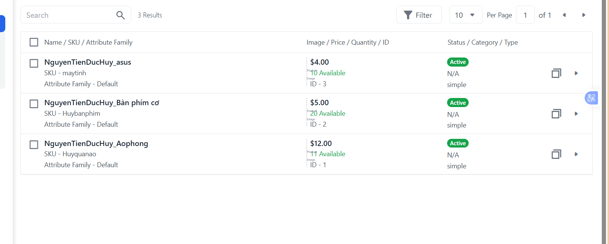
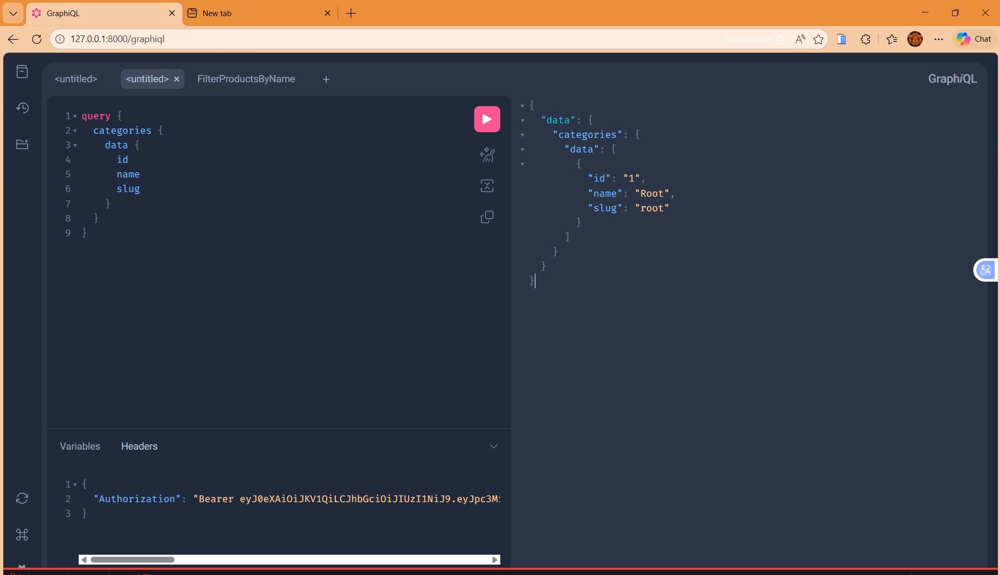
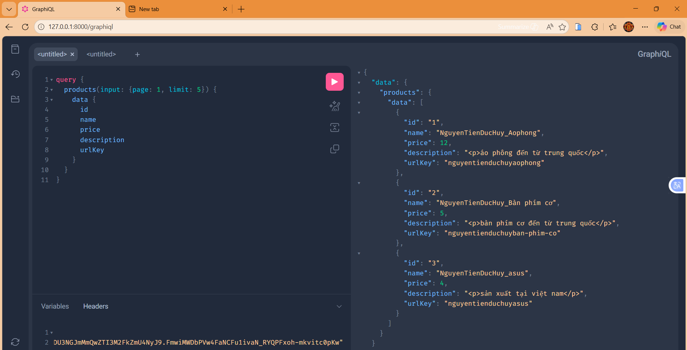
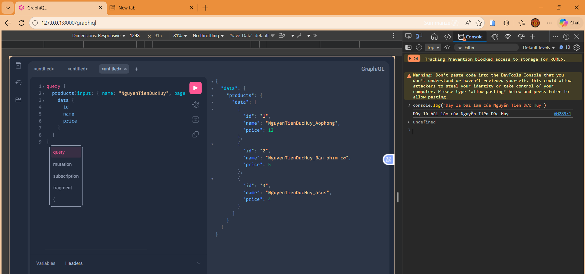
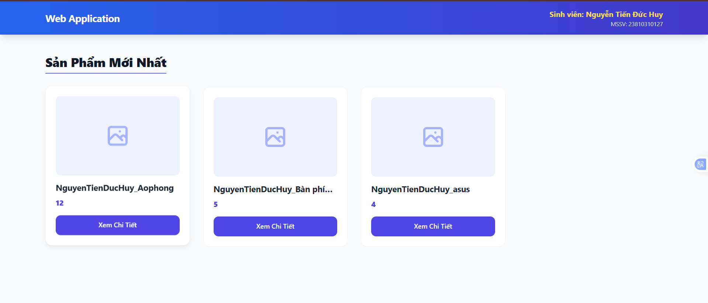

# Báo Cáo Đồ Án: Bagisto Headless Commerce

**Họ và tên:** Nguyễn Tiến Đức Huy
**MSSV:** [23810310127]
**Môn học:** [Lập trình web nâng cao]

---

## Phần 1: Cài đặt Hệ thống
Đã thực hiện cài đặt thành công Bagisto và extension `bagisto-headless`. Đã cấu hình Channel, Locale, Currency và tạo tài khoản Admin.

**Minh chứng danh sách 03 sản phẩm đã thêm:**
*(Sản phẩm được đặt tên theo cú pháp NguyenTienDucHuy_[Tên sản phẩm])*



---

## Phần 2: Khai thác GraphQL API
Sử dụng GraphQL Playground để thực hiện các truy vấn dữ liệu.
**Minh chứng Query 1:**


**Minh chứng Query 2:**


**Minh chứng Query 3:**


---

## Phần 3: Xây dựng Frontend
Xây dựng trang giao diện cửa hàng lấy dữ liệu trực tiếp từ Bagisto thông qua GraphQL API.

**Ảnh chụp giao diện:**


**Đoạn mã Fetch API (có giải thích):**
```javascript
// Cấu hình URL endpoint của GraphQL Bagisto 
const GRAPHQL_ENDPOINT = '[http://127.0.0.1:8000/graphql](http://127.0.0.1:8000/graphql)';

// Query lấy 5 sản phẩm mới nhất
const query = `
    query {
        products(input: { page: 1, limit: 5 }) {
            data { id, name, price, description }
        }
    }
`;

// Gửi HTTP Request dạng POST đến GraphQL Endpoint
async function fetchProducts() {
    const response = await fetch(GRAPHQL_ENDPOINT, {
        method: 'POST',
        headers: { 'Content-Type': 'application/json' },
        // Chuyển chuỗi query sang định dạng JSON để server hiểu
        body: JSON.stringify({ query }) 
    });
    const result = await response.json();
    console.log(result);
}
